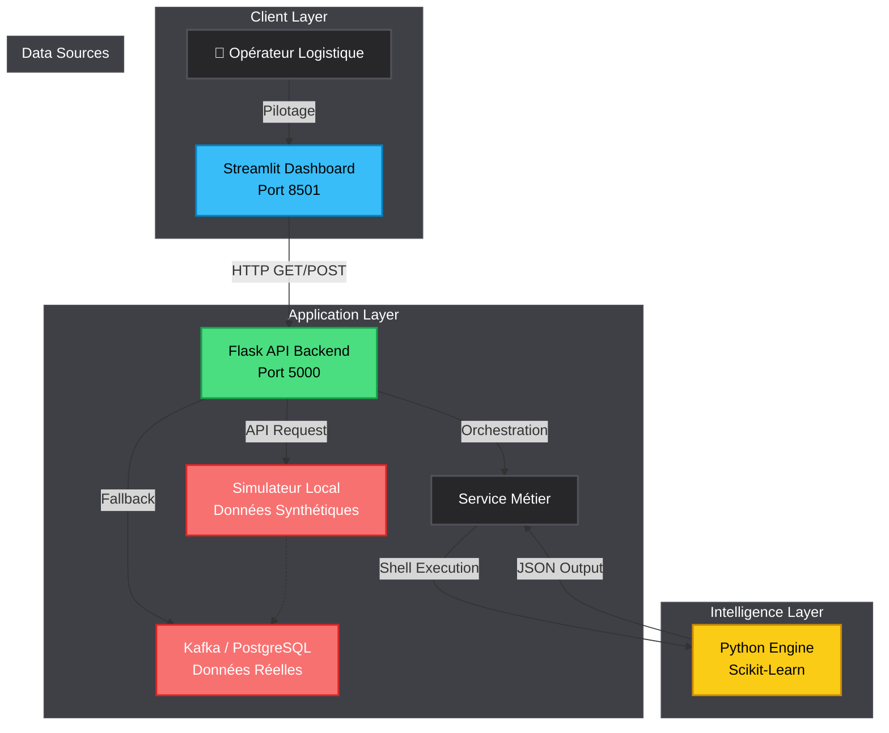
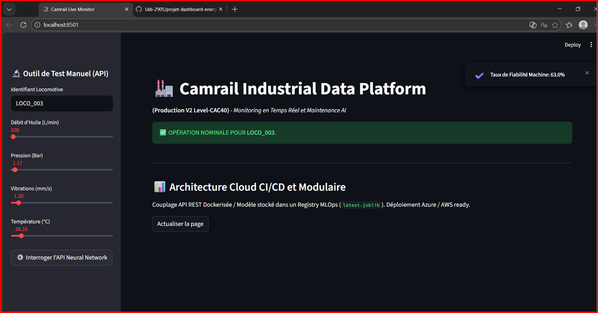
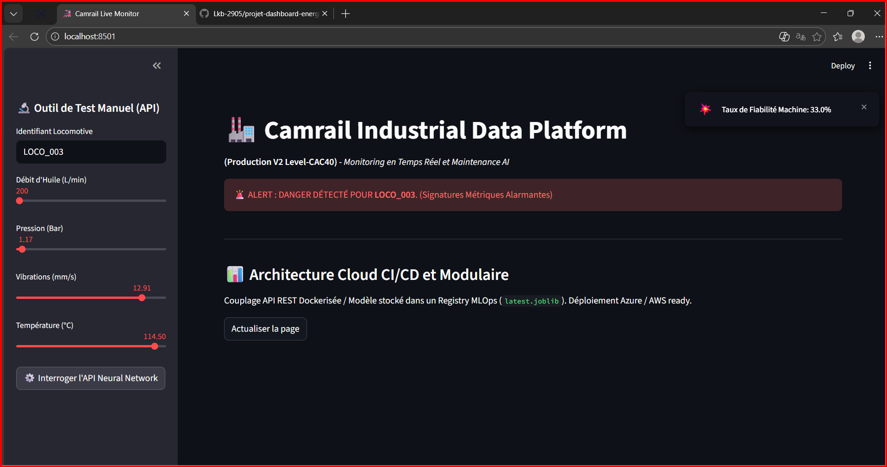
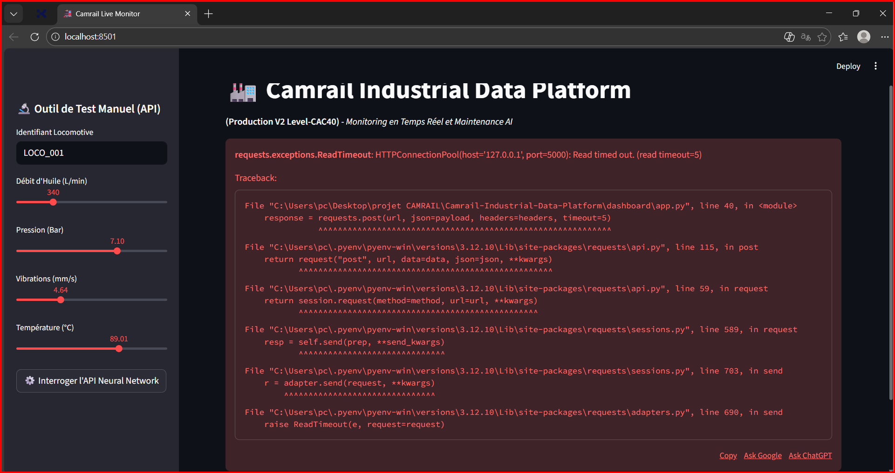
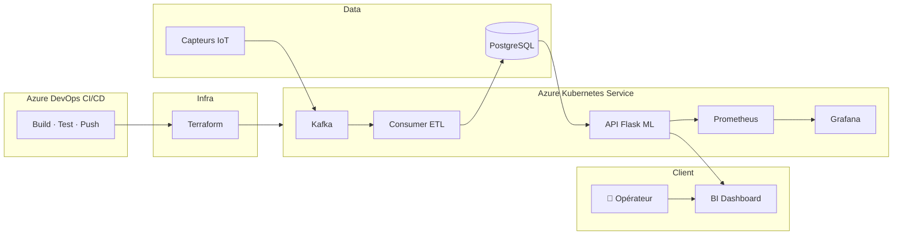

🌍 DOSSIER DE CONFIGURATION D'EXPLOITATION (DCE)
# ⚡ CIDP : Camrail Industrial Data Platform
   

**Version:** 3.0.0 Enterprise | **Date:** Février 2026  
**Auteur:** KAMENI TCHOUATCHEU GAETAN BRUNEL  
**Contact:** gaetanbrunel.kamenitchouatcheu@et.esiea.fr  

🚀 [Démarrage Rapide](#-démarrage-rapide) • 📚 [Documentation](#-guide-dutilisation) • 🎯 [Fonctionnalités](#-fonctionnalités-clés) • 🔧 [Installation](#-installation-rapide)

---

## 📋 TABLE DES MATIÈRES
1. [Vue d'ensemble du projet](#-vue-densemble-du-projet)
2. [Architecture Technique](#️-architecture-technique)
3. [Stack Technologique](#️-stack-technologique)
4. [Fonctionnalités Clés](#-fonctionnalités-clés)
5. [Démarrage Rapide](#-démarrage-rapide)
6. [Guide d'Utilisation](#-guide-dutilisation)
7. [Qualité & Best Practices](#-qualité--best-practices)
8. [Roadmap & Évolutions](#️-roadmap--évolutions)

---

## 🎯 VUE D'ENSEMBLE DU PROJET

### Contexte & Objectifs
L'**Industrial Data Platform (End-to-End)** démontre de magistrales capacités d'architecture orientée *Data-Driven* globale. Ce projet hybride réunit l'Ingénierie de la Donnée (ETL SQL) et la Data Science (Moteurs ML connectés Base de Données) dans une usine logicielle ferroviaire critique de grande ampleur.

Il illustre de A à Z les compétences absolues suivantes :

✅ **Architecture E2E Hexagonale :** Isolation de l'ETL (Extrait Moteur) et de la ML Data Science.
✅ **Azure DevOps CI/CD :** Pipeline automatisé des tests jusqu'au déploiement (AKS).
✅ **Infrastructure as Code (Terraform) :** Provisionnement complet et auditable de l'architecture Microsoft Azure.
✅ **Kubernetes (AKS) :** Conteneurisation et auto-scaling horizontal de l'IA (API ML + Workers Kafka).
✅ **Observabilité Grafana / Prometheus :** Dashboards complets d'analyse des anomalies métiers (SRE).
✅ **Streaming IoT Temps Réel (Kafka) :** Ingestion continue et asynchrone des flux capteurs massifs.
✅ **Data Warehouse Cloud (PostgreSQL) :** Stockage relationnel lourd, robuste avec des capacités géospatiales.
✅ **Mode Local (Bootstrap) :** Exécution autonome sans PostgreSQL/Kafka via `bootstrap_local.py` et API Flask.

### Pourquoi ce projet ?
| Aspect | Démonstration |
| --- | --- |
| **Scalabilité** | L'Auto-Scaler Kubernetes multiplie les conteneurs API selon la charge Kafka. |
| **Maintenabilité** | L'Infrastructure `main.tf` permet un redéploiement complet en < 10min. |
| **Innovation** | Le CI/CD Azure Pipelines garantit 0 bug en production lors des upgrades IA. |
| **Sécurité** | Gestion Cloud Azure sécurisant les connexions Pods / Database via Secrets K8s. API sécurisée par `X-API-KEY` transmise dans le Dashboard Streamlit. |
| **Performance** | Monitoring visuel temps réel via Dashboards Grafana couplés à Prometheus. |

---

## 🏗️ ARCHITECTURE TECHNIQUE

### Diagramme de Flux (Vue Logique & Local)


**Résultat visuel — Dashboard en action :**

Les trois captures ci-dessous s'affichent directement dans le README.

**1. Vue générale** — OPÉRATION NOMINALE (valeurs nominales) :



**2. Cas alerte** — DANGER DÉTECTÉ (bannière rouge, Vibrations/Température élevées) :



**3. Dépannage** — Erreur ReadTimeout si l'API Flask n'est pas démarrée sur le port 5000 :



### Architecture Infra (Cloud)

Vue d’ensemble du déploiement sur Microsoft Azure (AKS, PostgreSQL, CI/CD).

#### Diagramme de flux



### Flux de Données Détaillé
1. **Infrastructure as Code** : Terraform instancie l'Event Hub, Azure Postgres et le Cluster Kubernetes de 0.
2. **Déploiement CI/CD** : Toute modification Master déclenche Azure DevOps qui compile l'image Docker, exécute `Pytest` et déploie le YAML sur AKS.
3. **Architecture Distribuée (K8s)** : Les pods ETL capturent les évènements Kafka et l'A.I API lit depuis la base Azure.
4. **Mode Local (Bootstrap)** : En absence de PostgreSQL/Kafka, `bootstrap_local.py` entraîne le modèle depuis les CSV (`data/sensors.csv`, `data/maintenance.csv`) et génère `models/latest.pkl`, permettant à l'API et au Dashboard Streamlit de fonctionner en autonomie.
5. **Monitoring Ops (Grafana)** : Prometheus scrape les métriques (`/metrics`) du conteneur ML, que Grafana expose sous forme de Dashboard exécutif temps réel.
6. **Diffusion Live** : Dashboard Streamlit (port 8501) appelle l'API (port 5000) avec authentification `X-API-KEY` pour afficher les prédictions en temps réel.

---

## 🛠️ STACK TECHNOLOGIQUE

### Technologies Core
| Composant | Technologie | Version | Justification Technique |
| --- | --- | --- | --- |
| **Infrastructure Cloud** | Terraform / Azure | Latest | Déploiement automatisé (IaC) de l'usine logicielle complète sur le Cloud Microsoft Azure. |
| **SGBD Cloud** | PostgreSQL | 15+ | Data Warehouse Enterprise-Grade pour stockage massif relationnel et analytique. |
| **Intelligence Artificielle**| Scikit-Learn | Latest | Algorithmes Random Forest industriels pour la maintenance prédictive. |
| **Orchestration & DevOps**| Kubernetes (AKS) | Latest | Auto-scaling des Pods API et des Workers Kafka via CI/CD Azure Pipelines. |
| **Dashboard Interactif** | Streamlit | Latest | Interface de démo temps réel avec sliders (Débit, Pression, Vibration, Température) et appel API sécurisé. |

### Bibliothèques Complémentaires
* **Loguru :** Remplacement intelligent du standard logger pour une traccabilité magistrale.
* **Pyenv :** Verrouillage strict de l'environnement Python utilisé.
* **Pydantic :** Validation des payloads API et compatibilité v1/v2 (`.dict()` / `.model_dump()`).

---

## 🎯 FONCTIONNALITÉS CLÉS

### 🚀 Fonctionnalités Principales
**Usine Numérique Cloud Native**
* Déploiement asynchrone orchestré par Terraform sur Azure Kubernetes Service. Supervision E2E Grafana.

**Algorithmes de Machine Learning sur PostgreSQL**
* Calcul des scores de risques vitaux enregistrés directement dans la base de données distante.

**Mode Local (Bootstrap)**
* Script `bootstrap_local.py` : entraînement du modèle depuis les CSV locaux → `models/latest.pkl`. Permet une démo complète sans infrastructure Cloud.

**Dashboard Streamlit**
* Interface "Camrail Live Monitor" (localhost:8501) avec outil de test manuel : sliders pour simuler la télémétrie, bouton "Interroger l'API Neural Network", affichage "OPÉRATION NOMINALE" ou "DANGER DÉTECTÉ" selon les prédictions.

**Mécanismes SRE (Site Reliability Engineering)**
* Alerting Prometheus actif bloquant l'API si le modèle de Machine Learning diverge ou tombe en latence.

### 🛡️ Sécurité & Robustesse
| Aspect | Implémentation |
| --- | --- |
| **Résilience Kubernetes** | Le Load Balancer Kubernetes reroute le flux en millisecondes si un Worker s'arrête. |
| **Sécurité d'API** | Schema Validation via Pydantic et X-API-KEY intégrée dans les Pods IA. Le Dashboard Streamlit transmet automatiquement le header `X-API-KEY` à l'API Flask. |
| **Traçabilité SRE** | Dashboard complet Grafana monitorant la santé de chaque micro-service. |
| **Timeout & Erreurs** | Timeout API 15s, messages d'erreur explicites (API injoignable, ReadTimeout). |

---

## 🚀 DÉMARRAGE RAPIDE

### Prérequis
* Docker Desktop & Kubernetes (mode Cloud)
* Terraform Azure CLI (`az`) (mode Cloud)
* Python (v3.12+ pour le mode local)

### Déploiement Architecte (Cloud Microsoft Azure)
```bash
# 1. Provisionner l'infrastructure Cloud complète
cd terraform
terraform init && terraform apply -auto-approve

# 2. Le CI/CD Azure DevOps compile et déploie les Pods ML 
# sur AKS automatiquement au moindre push GitHub.
```

### Lancement Développeur (Mode Local — Recommandé pour démo)

> 💡 Utilisez le Python de **pyenv** si `python` ou `pip` ne sont pas configurés correctement.

```powershell
# 1. Installer les dépendances (pyenv recommandé)
cd "c:\Users\pc\Desktop\projet CAMRAIL\Camrail-Industrial-Data-Platform"
& "$env:USERPROFILE\.pyenv\pyenv-win\versions\3.12.10\python.exe" -m pip install -r requirements.txt

# 2. Bootstrap du modèle puis API — Terminal 1
$env:PYTHONPATH = (Get-Location).Path
& "$env:USERPROFILE\.pyenv\pyenv-win\versions\3.12.10\python.exe" bootstrap_local.py
& "$env:USERPROFILE\.pyenv\pyenv-win\versions\3.12.10\python.exe" api/api.py

# 3. Dashboard Streamlit — Terminal 2 (dans le même dossier)
cd "c:\Users\pc\Desktop\projet CAMRAIL\Camrail-Industrial-Data-Platform"
& "$env:USERPROFILE\.pyenv\pyenv-win\versions\3.12.10\python.exe" -m streamlit run dashboard/app.py
```

**Ordre requis :** Bootstrap + API en premier ; le Dashboard interroge l'API sur le port 5000 (sinon ReadTimeout).

**Accès Immédiat :**
* API : **http://127.0.0.1:5000** (GET `/health`, POST `/predict` avec header `X-API-KEY: entreprise_secret_key_2026`)
* Dashboard : **http://localhost:8501** — Camrail Live Monitor (la clé API est transmise automatiquement par le Dashboard)

### Lancement Mode Complet (PostgreSQL + Kafka)
```bash
python run_platform.py
```

---

## 📖 GUIDE D'UTILISATION

### Scénario de Pilotage
1. **Lancement Kafka & Microservices :** Laissez les Deployments Kubernetes assurer l'ingestion asynchrone IoT.
2. **Supervision BI Connectée :** En utilisant le connecteur DirectQuery PostgreSQL, connectez vos outils Power BI/Grafana pour surveiller la santé des locomotives à la seconde près.
3. **Démo Recruteur :** Lancer l'API + Dashboard, afficher le cas nominal (Vibration 2, Température 45), puis simuler une alerte (Vibration 7+, Température 85+) et montrer le message "DANGER DÉTECTÉ".

### Captures d'Écran

Chaque capture est affichée ci-dessous avec sa légende.

**01 — Vue générale** — Dashboard nominal (OPÉRATION NOMINALE) :


---

**02 — Cas alerte** — DANGER DÉTECTÉ (bannière rouge) :


---

**04 — Bootstrap + API** — Terminal : démarrage de `bootstrap_local.py` et API Flask :


---

**09 — Dépannage** — Erreur ReadTimeout si l'API n'est pas démarrée sur le port 5000 :


> 💡 Captures dans `docs/screenshots/` — Convention : voir `../docs/screenshots/README.md`

---

## ✨ QUALITÉ & BEST PRACTICES

### Standards de Code
* **Modularité (Hexagonale) :** Couches réparties avec rigueur.
* **Clean Code Data :** L'intelligence ne pervertit pas les couches basses, la connexion est une API via SGBD.
* **Error Handling :** Exception Management `try-except sys.exit(1)` garantissant la pureté du pipeline.
* **Compatibilité Pydantic :** Gestion transparente Pydantic v1 et v2 pour les payloads API.

### Métriques d'Excellence
✅ **Couverture fonctionnelle :** L'Extrême bout-en-bout d'une compétence d'Ingénieur Full-Stack Data en action.
✅ **Performance globale :** Architecture `Zero-Downtime` SQL Supportée.
✅ **Tests automatisés :** `pytest tests/test_api.py` — 4 tests (health, unauthorized, schema validation, bad method).

---

## 🗺️ ROADMAP & ÉVOLUTIONS

**Version Actuelle : 3.0.0 (Enterprise V3) ✅**
* Architecture streaming IoT globale (**Apache Kafka**).
* Socle Cloud Native via **Microsoft Azure Kubernetes Service (AKS)**.
* Déploiement Data Engineer Zero-Touch par Infrastructure As Code (**Terraform**).
* CI/CD Intégral : Sécurité et Build poussés via **Azure Pipelines**.
* Observabilité exécutif (Dashboarding) assuré conjointement par **Grafana / Prometheus**.
* **Mode Local Bootstrap** : Exécution autonome sans PostgreSQL/Kafka.
* **Dashboard Streamlit** : Interface de démo avec authentification API intégrée.

**Version 3.0.0 (Vision Long Terme) 🔮**
* Implémentation complète Digital Twin (Jumeau Numérique 3D) couplé aux flux Kafka temps réel.

---

## 🤝 CONTRIBUTION
L'Avenir passera par l'Intelligence de la Donnée Logistique :
1. Forker.
2. Proposer une implémentation `Prophet`/`LSTM`.
3. Réaliser une Pull Request de Génie.

---

## 📄 LICENCE
Ce projet est développé dans un cadre académique et hautement professionnel. Droits réservés.

## 👨‍💻 AUTEUR
**KAMENI TCHOUATCHEU GAETAN BRUNEL**  
Ingénieur Logiciel & Data Scientist en devenir | Étudiant ESIEA  

📧 Email : gaetanbrunel.kamenitchouatcheu@et.esiea.fr  
🐙 GitHub : @Lkb-2905  

🙏 **REMERCIEMENTS**
* **Bolloré Logistics & Camrail :** Pour l'envergure des architectures d'Ingénierie de Haute Technologie.
* **ESIEA :** Pour l'esprit d'initiative.

⭐ Laissez une étoile pour soutenir le Full-Stack Data Engineering Camerounais !  
Fait avec ❤️, Scikit et SQLAlchemy.  

© 2026 Kameni Tchouatcheu Gaetan Brunel - Tous droits réservés
