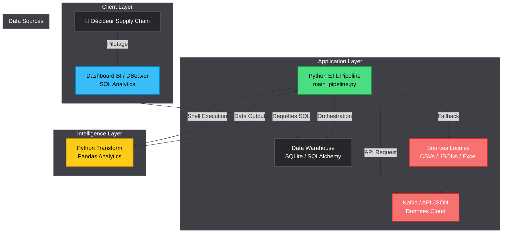
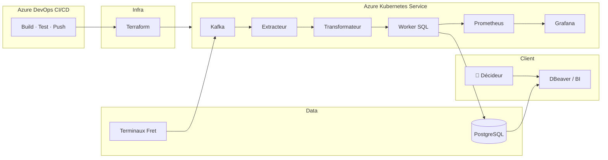

🌍 DOSSIER DE CONFIGURATION D'EXPLOITATION (DCE)
# ⚡ DPA : Data Pipeline Automation
   

> ⚠️ **NB IMPORTANT** : *Il s'agit d'un projet personnel/étudiant. Le nom "Camrail" est utilisé uniquement pour donner un contexte industriel réaliste à cette simulation. Aucune donnée réelle ou privée n'est exploitée. Tous les documents, architectures et données présentés ici sont intégralement fictifs et créés de toutes pièces pour simuler un projet académique de Data Engineering.*

**Version:** 1.0.0 Stable | **Date:** Février 2026  
**Auteur:** KAMENI TCHOUATCHEU GAETAN BRUNEL  
**Contact:** gaetanbrunel.kamenitchouatcheu@et.esiea.fr  

🚀 [Démarrage Rapide](#-démarrage-rapide) • 📚 [Documentation](#-guide-dutilisation) • 🎯 [Fonctionnalités](#-fonctionnalités-clés) • 🔧 [Installation](#-installation-rapide)

---

## 📋 TABLE DES MATIÈRES
1. [Vue d'ensemble du projet](#-vue-densemble-du-projet)
2. [Architecture Technique](#️-architecture-technique)
3. [Stack Technologique](#️-stack-technologique)
4. [Fonctionnalités Clés](#-fonctionnalités-clés)
5. [Démarrage Rapide](#-démarrage-rapide)
6. [Guide d'Utilisation](#-guide-dutilisation)
7. [Qualité & Best Practices](#-qualité--best-practices)
8. [Roadmap & Évolutions](#️-roadmap--évolutions)

---

## 🎯 VUE D'ENSEMBLE DU PROJET

### Contexte & Objectifs
Ce projet illustre l'implémentation robuste d'une architecture **Data-Driven (ETL)** pour le pilotage logistique des données de fret. Il répond aux exigences d'une gouvernance informatique moderne en unifiant les données, les fichiers épars et les signaux métiers.

Il illustre les compétences suivantes :

✅ **Azure DevOps CI/CD :** Pipeline automatisé des tests jusqu'au déploiement (AKS).
✅ **Infrastructure as Code (Terraform) :** Provisionnement complet et auditable de l'architecture Microsoft Azure.
✅ **Kubernetes (AKS) :** Conteneurisation et auto-scaling horizontal des pods ETL.
✅ **Observabilité Grafana / Prometheus :** Dashboards complets d'analyse des flux de données.
✅ **Streaming Asynchrone (Kafka) :** Les signaux logistiques sont bufferisés via topics.
✅ **Data Warehouse Cloud (PostgreSQL) :** Stockage sécurisé et hautement performant sur Microsoft Azure.

### Pourquoi ce projet ?
| Aspect | Démonstration |
| --- | --- |
| **Scalabilité** | L'Auto-Scaler Kubernetes multiplie les conteneurs ETL selon la charge de données arrivant dans Kafka. |
| **Maintenabilité** | L'Infrastructure `main.tf` (Terraform) permet de cloner l'environnement de production sur Azure en quelques minutes. |
| **Innovation** | Le CI/CD Azure Pipelines garantit 0 bug en production lors des déploiements logistiques. |
| **Sécurité** | Gestion Cloud Azure sécurisant les connexions Pods / Database via Secrets et authentifications fortes. |
| **Business Value** | Dote les gestionnaires de KPI calculés et requêtes avancées (Data Warehouse Azure). |

---

## 🏗️ ARCHITECTURE TECHNIQUE

### Diagramme de Flux (Vue Logique & ETL Local)


**Résultat visuel — Pipeline et DWH :**

Les deux captures ci-dessous s'affichent directement dans le README.

**1. Exécution du pipeline ETL** — Logs Extract / Transform / Load lors du lancement de `main_pipeline.py` :


**2. Base DWH SQLite** — Vue de la base `supply_chain_dwh.sqlite` dans DBeaver (tables `fact_transactions`, `aggr_daily_site_stats`) :


### Architecture Infra (Cloud)

Vue d’ensemble du déploiement sur Microsoft Azure (AKS, PostgreSQL, CI/CD).



### Flux de Données Détaillé
1. **Infrastructure as Code** : Terraform instancie Microsoft Azure PostgreSQL, Event Hubs et AKS.
2. **Déploiement CI/CD** : Azure DevOps compile et pousse l'image Docker ETL vers AKS pour son exécution en Pods.
3. **Extraction & Transformation (K8s)** : Les micro-services récupèrent la donnée Kafka en direct et fusionnent les tables via Pandas.
4. **Chargement SQL & SRE** : Les données sont chargées en Bulk Upsert sur Azure Postgres. Prometheus et Grafana monitorent le flux de santé absolu de l'architecture Big Data.

---

## 🛠️ STACK TECHNOLOGIQUE

### Technologies Core
| Composant | Technologie | Version | Justification Technique |
| --- | --- | --- | --- |
| **Orchestrateur** | Python | 3.12+ | L'outil complet de traitement universel par batch d'ingénierie. |
| **Base de Données** | SQLite | 3+ | DWH de fichier ultra-léger et transportable localement. |
| **Data Engine** | Pandas | Latest | Traitement et jointure rapide de la donnée en RAM. |
| **ORM et Mapping** | SQLAlchemy | Latest | Connectivité et sécurité des transactions SQL (pas de SQL syntax direct en paramètre métier). |

### Bibliothèques Complémentaires
* **Loguru/Logging :** Traçabilité exhaustive.
* **Openpyxl :** Lecture/écriture Excel (source ERP, export rapports).
* **PyODBC :** Connexion Microsoft Access (bases legacy, migration).
* **OS/Sys :** Commandes natives utiles à l'interaction Windows (Task Scheduler).

---

## 🎯 FONCTIONNALITÉS CLÉS

### 🚀 Fonctionnalités Principales
**Gouvernance Data Temps Réel**
* Consolidations des flux épars vers une Base Unique.
* Création propre et persistante de `supply_chain_dwh.sqlite`.

**Système Avancé de Requêtage**
* Déploiement de scripts SQL analytiques poussés pour catégoriser la fiabilité du système (Hub Logistics Classification).

**Intégration Excel / Access**
* **Source Excel :** Lecture de fichiers Excel comme alternative au CSV ERP via `extract_from_excel()`.
* **Export automatique :** Rapport multi-feuilles vers `reports/rapport_supply_chain.xlsx` à chaque exécution.
* **Access :** Export pour import Access (migration métier). Voir `exemples_excel_access/` pour les cas d'usage complets.

**Gestion des Risques**
* Tolérance du Pipeline en mode fail-safe sur corruption partielle de fichier.

### 🛡️ Sécurité & Robustesse
| Aspect | Implémentation |
| --- | --- |
| **Validation** | Vérification et parsing stricts avant transaction. |
| **Résilience** | Base de données SQL protégée des deadlocks et échecs (Rollbacks). |
| **Traçabilité** | Logs détaillés sur serveurs ou scripts chronologiques. |

---

## 🚀 DÉMARRAGE RAPIDE

### Prérequis
* Python (v3.12+)

### Installation Rapide
```powershell
# 1. Cloner le projet (Naviguer au sein du répertoire)
cd Data-Pipeline-Automation
pip install -r requirements.txt
cd src
python main_pipeline.py
```

### Lancement Développeur (Mode Local — Recommandé pour démo)

> 💡 Utilisez le Python de **pyenv** si `python` ou `pip` ne sont pas configurés correctement.

```powershell
# 1. Installer les dépendances (pyenv recommandé)
cd "c:\Users\pc\Desktop\projet CAMRAIL\Data-Pipeline-Automation"
& "$env:USERPROFILE\.pyenv\pyenv-win\versions\3.12.10\python.exe" -m pip install -r requirements.txt

# 2. Lancer l'Orchestrateur Complet (ETL)
cd src
& "$env:USERPROFILE\.pyenv\pyenv-win\versions\3.12.10\python.exe" main_pipeline.py
```

**Accès Immédiat :** Les tables historiques sont fraîches et disponibles instantanément dans `database/supply_chain_dwh.sqlite`. L'export Excel est généré automatiquement dans `reports/rapport_supply_chain.xlsx`.

> 💡 **Excel / Access :** Exemples et cas d'usage dans `exemples_excel_access/`. Depuis la racine du projet : `pip install -r exemples_excel_access/requirements.txt` puis `python exemples_excel_access/run_exemples.py`. Les sorties sont dans `exemples_excel_access/output/`.

---

## 📖 GUIDE D'UTILISATION

### Scénario de Pilotage
1. **Lancement Quotidien :** L'outil tourne la nuit via scheduler.
2. **Requêtage Expert :** Un Data Analyst peut soumettre `sql/advanced_queries.sql` au DBeaver de la base.
3. **Action:** Construction de Dashboard et exports métier sur l'activité des "Gares".

### Captures d'Écran

Chaque capture est affichée ci-dessous avec sa légende.

**1. Exécution Pipeline ETL** — Logs Extract / Transform / Load lors du lancement de `main_pipeline.py` :


---

**2. Base DWH SQLite** — Vue de la base `supply_chain_dwh.sqlite` dans DBeaver (tables `fact_transactions`, `aggr_daily_site_stats`) :


> 💡 Captures dans `docs/screenshots/` — Convention : voir `../docs/screenshots/README.md`

---

## ✨ QUALITÉ & BEST PRACTICES

### Standards de Code
* **Modularité (Engine) :** Couches E, T, et L isolées nativement.
* **Typage (Data) :** Cast structurés au sein des Dataframes ; harmonisation des types (ex. `machine_id` en string) pour compatibilité source Excel au merge.
* **Error Handling :** Blocs robustes limitant l'écrasement bdd en cas de corruption.

### Métriques d'Excellence
✅ **Architecture :** DWH Single Source of Truth respecté (SSOT).
✅ **Performance :** L'ORM insère des dizaines de milliers de lignes en lots optimisés (bulk).

---

## 🗺️ ROADMAP & ÉVOLUTIONS

**Version Actuelle : 2.0.0 (Enterprise V2) ✅**
* Architecture Data Streaming en Event-Driven via Apache Kafka.
* Virtualisation Globale : Orchestration via Docker Compose complet.
* Base de Données : Connecteur vers Cloud Azure PostgreSQL et Prometheus SRE.
* **Intégration Excel/Access :** Source Excel, export automatique vers `reports/rapport_supply_chain.xlsx`, exemples dans `exemples_excel_access/`.
* Documentation exhaustive DCE.

**Version 3.0.0 (Vision Long Terme) 🔮**
* Implémentation de Streaming Machine Learning Temps Réel.

---

## 🤝 CONTRIBUTION
Les contributions sont les bienvenues pour industrialiser ce socle métier logistique.
1. Forker.
2. Définir une Feature Branche.
3. Valider par PR documentée.

---

## 📄 LICENCE
Ce projet est développé dans un cadre académique et professionnel. Droits réservés.

## 👨‍💻 AUTEUR
**KAMENI TCHOUATCHEU GAETAN BRUNEL**  
Ingénieur Logiciel & Data Scientist en devenir | Étudiant ESIEA  

📧 Email : gaetanbrunel.kamenitchouatcheu@et.esiea.fr  
🐙 GitHub : @Lkb-2905  

🙏 **REMERCIEMENTS**
* **Camrail / Bolloré Logistics :** Pour l'approche industrielle robuste Data Management.
* **ESIEA :** Pour l'excellence informatique et académique.

⭐ Si ce projet vous semble pertinent pour la Supply Chain de demain, laissez une étoile !  
Fait avec ❤️, Python et du SQL.  

© 2026 Kameni Tchouatcheu Gaetan Brunel - Tous droits réservés
