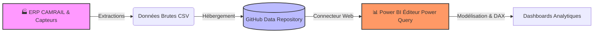

🌍 DOSSIER DE CONFIGURATION D'EXPLOITATION (DCE)
# ⚡ CAMRAIL — Data Engineering & Data Analysis : ERP Industriel vers Dashboards Power BI

   

**Version:** 3.0.0 Enterprise | **Date:** Février 2026  
**Auteur:** KAMENI TCHOUATCHEU GAETAN BRUNEL  
**Contact:** gaetanbrunel.kamenitchouatcheu@et.esiea.fr  

🚀 [Architecture](#-architecture-du-projet) • 📊 [Tableaux de Bord](#-aperçu-des-tableaux-de-bord) • 📈 [KPIs](#-kpis-calculés) • 🛠️ [Utilisation](#-comment-utiliser-ce-projet)

---

## 📋 TABLE DES MATIÈRES

1. [Vue d'ensemble du projet](#-vue-densemble-du-projet)
2. [Architecture du projet](#-architecture-du-projet)
3. [KPIs calculés](#-kpis-calculés)
4. [Aperçu des Tableaux de Bord](#-aperçu-des-tableaux-de-bord)
5. [Technologies utilisées](#-technologies-utilisées)
6. [Comment utiliser ce projet](#-comment-utiliser-ce-projet)
7. [Guide d'utilisation](#-guide-dutilisation)
8. [Qualité & Best Practices](#-qualité--best-practices)
9. [Roadmap & Évolutions](#-roadmap--évolutions)

---

## 🎯 VUE D'ENSEMBLE DU PROJET

### Contexte & Objectifs

Ce projet est un démonstrateur complet de **Data Engineering & Data Analysis** appliqué au pilotage logistique industriel. Il simule l'extraction de données transactionnelles quotidiennes d'un ERP industriel (**CAMRAIL**), leur nettoyage, leur modélisation en **Star Schema** et la production de rapports **Power BI** professionnels destinés à la prise de décision opérationnelle.

Il illustre les compétences suivantes :

✅ **Extraction de données** : Collecte des flux transactionnels ERP (CSV) et capteurs.  
✅ **Nettoyage & Transformation** : Pipeline de préparation des données (Power Query).  
✅ **Modélisation en étoile** : Schéma Star Schema pour des requêtes analytiques optimales.  
✅ **Visualisation Business** : Dashboards Power BI orientés pilotage et décision.  
✅ **KPIs métier** : Taux d'erreur, volume, fiabilité du parc machine, analyse temporelle.  
✅ **Industrialisation** : Documentation DCE, conventions de nommage, réutilisabilité.

### Pourquoi ce projet ?

| Aspect | Démonstration |
| --- | --- |
| **Pilotage** | Dashboards exécutifs et opérationnels pour la Supply Chain. |
| **Fiabilité** | Suivi de la qualité des données et du pipeline de traitement. |
| **Maintenance** | Identification des machines à risque et optimisation du parc. |
| **Analyse temporelle** | Compréhension des shifts et tendances horaires/journalières. |
| **Scalabilité** | Architecture modulaire prête pour des sources multiples (Cloud, APIs). |

---

## 🏗️ ARCHITECTURE DU PROJET

### Flux de données (Source → Dashboards)

### Étapes du pipeline

1. **Extraction** : Données transactionnelles quotidiennes (ERP) et signaux capteurs → fichiers CSV.  
2. **Hébergement** : Stockage structuré (repository GitHub ou dossier local) pour traçabilité.  
3. **Power Query** : Connecteur Web ou fichier → import, nettoyage, typage des colonnes.  
4. **Modélisation** : Création du modèle Star Schema (fait central + dimensions).  
5. **DAX** : Calcul des KPIs (Taux Erreur, agrégations, mesures conditionnelles).  
6. **Dashboards** : Visualisations interactives pour le pilotage opérationnel.

---

## 📈 KPIs CALCULÉS

Les indicateurs clés suivants sont calculés et exposés dans les tableaux de bord :

| KPI | Description | Usage métier |
| --- | --- | --- |
| **Volume Total** | Somme des volumes transférés (opérations) | Mesure de l'activité globale. |
| **Total Errors** | Nombre de transactions en statut ERR | Criticité opérationnelle. |
| **Machines Actives** | Nombre distinct de machines ayant généré des transactions | Couverture du parc. |
| **Total Transactions** | Nombre total de transactions | Volume d'activité. |
| **Taux d'Erreur** | `(Total Errors / Total Transactions) × 100` | Indicateur de qualité et fiabilité. |
| **Répartition par status_code** | Ventilation OK / WARN / ERR | Diagnostic de la qualité des opérations. |
| **Erreurs par machine_id** | Agrégation des erreurs par machine | Priorisation maintenance. |
| **Total Volume par jour** | Agrégation temporelle | Tendances et saisonnalité. |
| **Volume par Heure_Transaction** | Granularité horaire | Analyse des shifts. |
| **Heatmap Jour × Heure** | Matrice croisée (Jour_Semaine × Heure) | Identification des pics d'activité. |

---

## 📊 APERÇU DES TABLEAUX DE BORD

### 1. Vue Executive — Synthèse des Opérations

Tableau de bord managérial offrant une vue d'ensemble des KPIs essentiels : Taux Erreur, Total Errors, Machines Actives, Total Transactions, Total Volume. Graphique linéaire (Total Volume par Jour), graphique en anneau (répartition par status_code) et barres horizontales (Total Errors par machine_id) pour une lecture rapide de la performance opérationnelle.

---

### 2. Performance du Parc Machine

Vue dédiée à l'analyse machine par machine : tableau avec Total Volume, Total Errors et Taux Erreur (formatage conditionnel vert/orange/rouge) et nuage de points croisant Volume et Taux Erreur pour identifier les machines à fort impact ou à risque prioritaire.

---

### 3. Analyse Temporelle & Suivi des Shifts

Analyse des tendances horaires et journalières : Total Errors par Heure_Transaction, Total Volume par Heure_Transaction, et heatmap Jour_Semaine × Heure permettant de détecter les pics d'activité et les créneaux les plus critiques pour la qualité des opérations.

---

### 4. Fiabilité du Pipeline de Données

Vue orientée qualité des données : flux des transactions (Total → status_code → machine_id) et jauge du Taux Erreur pour évaluer en un coup d'œil la fiabilité du pipeline et la santé des données ingérées.

---

### 5. Dashboard Streamlit (CIDP) — Supervision temps réel

Interface de pilotage connectée à l’API ML pour simuler la télémétrie (Débit, Pression, Vibrations, Température) et afficher les prédictions de risque.

**Vue générale** — OPÉRATION NOMINALE (valeurs nominales) :

**Cas alerte** — DANGER DÉTECTÉ (bannière rouge, Vibrations/Température élevées) :

**Dépannage** — Erreur ReadTimeout si l’API Flask n’est pas démarrée sur le port 5000 :

---

## 🛠️ TECHNOLOGIES UTILISÉES

| Composant | Technologie | Usage |
| --- | --- | --- |
| **Visualisation** | Power BI Desktop | Création des dashboards, rapports, partage. |
| **Formules métier** | DAX (Data Analysis Expressions) | Calcul des KPIs, mesures, agrégations. |
| **ETL & Connecteurs** | Power Query (M) | Import, nettoyage, transformation des données. |
| **Sources de données** | CSV | Données transactionnelles ERP (exportées ou simulées). |
| **Modélisation** | Star Schema | Fait central (transactions) + dimensions (machines, dates, statuts). |

### Rôle de chaque technologie

- **Power BI** : Interface unique pour la visualisation et l’interaction avec les données.  
- **DAX** : Calculs dynamiques (Taux Erreur, agrégations conditionnelles, rankings).  
- **Power Query** : Prétraitement, typage, filtrage avant chargement dans le modèle.  
- **CSV** : Format standard d’échange pour les données brutes (ERP, capteurs, logs).

---

## 🚀 COMMENT UTILISER CE PROJET

### Méthode recommandée : Power BI Desktop

1. **Télécharger** le fichier `.pbix` du projet (depuis le dépôt GitHub ou le dossier du projet).
2. **Ouvrir** le fichier avec **Power BI Desktop** (gratuit, [téléchargement Microsoft](https://powerbi.microsoft.com/fr-fr/desktop/)).
3. **Actualiser** les données si les chemins des sources CSV ont changé (Fichier → Options et paramètres → Options de source de données).
4. **Explorer** les tableaux de bord, appliquer les filtres (date, machine_id, status_code) et exporter les rapports si besoin.

### Option : Reconstruction à partir des CSV

Si le fichier `.pbix` n’est pas fourni, il est possible de reconstruire les dashboards :

1. Créer un nouveau rapport Power BI Desktop.  
2. Obtenir les données → Fichier texte/CSV (ou Web si les CSV sont hébergés).  
3. Appliquer les transformations Power Query nécessaires.  
4. Construire le modèle Star Schema et les mesures DAX selon les spécifications du projet (voir `POWER_BI_SPECS.md` dans les sous-projets).

---

## 📖 GUIDE D'UTILISATION

### Scénarios de pilotage

1. **Reporting exécutif** : Vue Synthèse des Opérations pour les réunions de direction.  
2. **Maintenance prédictive** : Vue Performance du Parc pour prioriser les interventions.  
3. **Optimisation des shifts** : Vue Analyse Temporelle pour adapter les plannings.  
4. **Qualité des données** : Vue Fiabilité du Pipeline pour auditer la chaîne de traitement.

### Filtres disponibles

- **date** : Plage temporelle des transactions.  
- **status_code** : OK, WARN, ERR.  
- **machine_id** : Filtrage par machine (ex. MCH-001, MCH-006).

---

## ✨ QUALITÉ & BEST PRACTICES

### Standards appliqués

- **Modélisation** : Star Schema pour des requêtes analytiques performantes.  
- **Naming** : Conventions cohérentes (snake_case, préfixes explicites).  
- **Documentation** : README, specs Power BI, schémas du modèle.  
- **Formatage conditionnel** : Utilisation du rouge pour les alertes (Taux Erreur, ERR).

### Métriques d'excellence

✅ **Couverture fonctionnelle** : 4 vues complémentaires (Executive, Parc, Shifts, Fiabilité).  
✅ **Lisibilité** : KPIs mis en évidence, visualisations adaptées au type d’analyse.  
✅ **Réutilisabilité** : Modèle modulaire, sources configurables.

---

## 🗺️ ROADMAP & ÉVOLUTIONS

**Version Actuelle : 3.0.0 Enterprise ✅**

- Extraction ERP simulée (CSV).  
- Modélisation Star Schema.  
- 4 tableaux de bord Power BI (Executive, Parc, Shifts, Fiabilité).  
- KPIs métier complets.  
- Documentation DCE.

**Version 3.1.0 (Prochaine Release) 🚧**

- Connexion DirectQuery vers PostgreSQL/SQLite.  
- Intégration des données du pipeline Python (DPA, CIDP, PM-D).

**Version 4.0.0 (Vision Long Terme) 🔮**

- Streaming temps réel (Power BI REST API, Kafka).  
- Déploiement Power BI Service (cloud).  
- Alertes et notifications automatiques.

---

## 🤝 CONTRIBUTION

Les contributions sont les bienvenues pour faire évoluer ce démonstrateur vers une solution industrielle.

1. Forker le projet.  
2. Créer une branche `feature/NomFeature`.  
3. Proposer une Pull Request avec description métier.

---

## 📄 LICENCE

Ce projet est développé dans un cadre académique et professionnel. Droits réservés.

---

## 👨‍💻 AUTEUR

**KAMENI TCHOUATCHEU GAETAN BRUNEL**  
Ingénieur Logiciel & Data Scientist en devenir | Étudiant ESIEA  

📧 Email : gaetanbrunel.kamenitchouatcheu@et.esiea.fr  
🐙 GitHub : @Lkb-2905  

🙏 **REMERCIEMENTS**

- **Bolloré Logistics & Camrail** : Pour l'inspiration des cas d'usage logistiques industriels.  
- **ESIEA** : Pour l'excellence de la formation ingénieur.

⭐ Si ce projet vous semble pertinent pour la Supply Chain de demain, laissez une étoile !  
Fait avec ❤️, Power BI et DAX.

© 2026 Kameni Tchouatcheu Gaetan Brunel — Tous droits réservés
