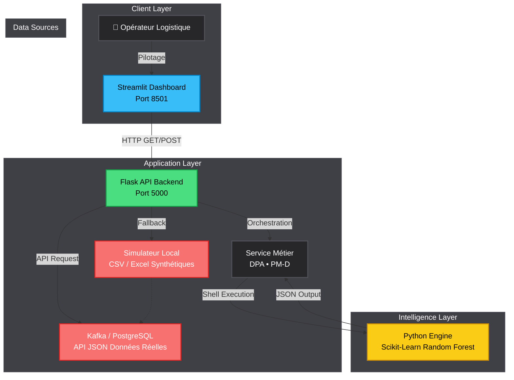

🌍 DOSSIER DE CONFIGURATION D'EXPLOITATION (DCE)
# ⚡ CAMRAIL : Chaîne Logistique Ferroviaire & Maintenance Prédictive
    

**Version:** 3.0.0 Enterprise | **Date:** Février 2026  
**Auteur:** KAMENI TCHOUATCHEU GAETAN BRUNEL  
**Contact:** gaetanbrunel.kamenitchouatcheu@et.esiea.fr  

🚀 [Démarrage Rapide](#-démarrage-rapide) • 📚 [Documentation](#-guide-dutilisation) • 🎯 [Fonctionnalités](#-fonctionnalités-clés) • 🔧 [Installation](#-installation-complète)

---

## 📋 TABLE DES MATIÈRES
1. [Vue d'ensemble du projet](#-vue-densemble-du-projet)
2. [Architecture Technique](#️-architecture-technique)
3. [Stack Technologique](#️-stack-technologique)
4. [Fonctionnalités Clés](#-fonctionnalités-clés)
5. [Démarrage Rapide](#-démarrage-rapide)
6. [Installation Complète](#-installation-complète)
7. [Guide d'Utilisation](#-guide-dutilisation)
8. [API Documentation](#-api-documentation)
9. [Qualité & Best Practices](#-qualité--best-practices)
10. [Roadmap & Évolutions](#️-roadmap--évolutions)

---

## 🎯 VUE D'ENSEMBLE DU PROJET

### Contexte & Objectifs
Ce projet démontre la mise en œuvre d'une architecture orientée **Data-Driven** pour le pilotage logistique ferroviaire (Camrail / Bolloré Logistics). Il répond aux exigences de la Supply Chain moderne en combinant ETL, maintenance prédictive par l'IA et supervision temps réel.

Il illustre les compétences suivantes :

✅ **Architecture Découplée :** Séparation stricte ETL (Pandas) / API ML (Flask) / Dashboard (Streamlit).
✅ **Data Science Intégrée :** Moteur prédictif Scikit-Learn (Random Forest) pour la maintenance prédictive des locomotives.
✅ **API RESTful :** Endpoints robustes avec validation Pydantic et authentification X-API-KEY.
✅ **UX Moderne :** Interface de pilotage réactive (Streamlit) avec sliders et feedback temps réel.
✅ **Industrialisation :** Plan de Continuité (PCR) dans chaque sous-projet (`DOSSIER_SECURITE_CONTINUITE_PCR.md`), documentation DCE, spécifications Power BI.
✅ **Excel / Access :** Intégration bureautique — import Excel (source ERP), export rapports, lecture Access (voir `exemples_excel_access/`).
✅ **Clean Code :** Modularité, tests automatisés (Pytest), compatibilité Pydantic v1/v2.

### Pourquoi ce projet ?
| Aspect | Démonstration |
| --- | --- |
| **Scalabilité** | Architecture prête pour Kafka, PostgreSQL et Kubernetes (AKS). |
| **Maintenabilité** | Code modulaire avec séparation ETL / ML / API / Dashboard. |
| **Innovation** | Hybride unique entre pipeline ETL, Data Science et monitoring temps réel. |
| **Sécurité** | X-API-KEY, validation Pydantic, secrets injectables. |
| **Performance** | Modèle ML sérialisé (Joblib), chargement asynchrone, mode bootstrap local. |

---

## 🏗️ ARCHITECTURE TECHNIQUE

### Diagramme de Flux


**Résultat visuel — Captures par composant :**
| DPA | CIDP | PM-D |
| --- | --- | --- |
| [Pipeline](docs/screenshots/05_dpa_pipeline_execution.png) • [DWH](docs/screenshots/06_dpa_sqlite_dwh.png) | [Vue](docs/screenshots/01_cidp_dashboard_vue_generale.png) • [Alerte](docs/screenshots/02_cidp_dashboard_alerte_danger.png) • [Dépannage](docs/screenshots/09_cidp_dashboard_error_timeout.png) | [Génération](docs/screenshots/07_pmd_generation_donnees.png) • [Training](docs/screenshots/08_pmd_model_training.png) |

### Flux de Données Détaillé
1. **Extraction (DPA) :** Données API JSON et ERP CSV → transformation Pandas → chargement SQLite.
2. **Prédiction (CIDP) :** Bootstrap ou PostgreSQL → entraînement Random Forest → `models/latest.pkl`.
3. **Supervision :** Dashboard Streamlit appelle l'API `/predict` avec télémétrie simulée (sliders).
4. **Maintenance (PM-D) :** Génération télémétrie → feature engineering → entraînement modèle → sérialisation Joblib.

---

## 🛠️ STACK TECHNOLOGIQUE

### Technologies Core
| Composant | Technologie | Version | Justification Technique |
| --- | --- | --- | --- |
| **Langage** | Python | 3.12+ | Standard Data Science, ETL, ML. |
| **API** | Flask | 3.x | Endpoints REST, intégration Prometheus. |
| **Dashboard** | Streamlit | Latest | Interface réactive, démo temps réel. |
| **Data AI** | Scikit-Learn | Latest | Random Forest pour maintenance prédictive. |
| **ETL** | Pandas | Latest | Manipulation vectorielle, jointures, agrégations. |
| **Base** | SQLite / PostgreSQL | 3+ / 15+ | DWH léger (local) ou Cloud. |

### Bibliothèques Complémentaires
* **Pydantic :** Validation des payloads API (compatibilité v1/v2).
* **Loguru :** Logging structuré avec rotation (10 MB / 30 jours).
* **Joblib :** Sérialisation rapide des modèles ML.
* **Prometheus_client :** Métriques SRE pour orchestrateurs.

---

## 🎯 FONCTIONNALITÉS CLÉS

### 🚀 Fonctionnalités Principales

**Supervision Temps Réel (CIDP)**
* Suivi des KPIs : Débit d'huile, Pression, Vibrations, Température.
* Dashboard Streamlit "Camrail Live Monitor" avec test manuel API.
* Affichage "OPÉRATION NOMINALE" ou "DANGER DÉTECTÉ" selon les prédictions.

**Intelligence Artificielle Prédictive**
* Modèle Random Forest pour détecter les risques de panne imminente.
* Mode bootstrap local (entraînement depuis CSV sans PostgreSQL/Kafka).
* Probabilité de risque et score binaire exposés via l'API.

**Gestion des Risques**
* Détection automatique des signatures métriques alarmantes.
* Alertes visuelles (bannière rouge) et taux de fiabilité machine.

**Reporting & DWH**
* Pipeline ETL (DPA) : `fact_transactions`, `aggr_daily_site_stats`.
* **Export Excel** automatique vers `reports/rapport_supply_chain.xlsx` (multi-feuilles).
* **Excel / Access :** Lecture Excel comme source, export pour import Access. Exemples dans `exemples_excel_access/`.
* Spécifications Power BI pour connexion DirectQuery PostgreSQL / SQLite.

### 🛡️ Sécurité & Robustesse
| Aspect | Implémentation |
| --- | --- |
| **Validation** | Pydantic strict sur tous les payloads API. |
| **Authentification** | Header X-API-KEY obligatoire pour `/predict`. |
| **Résilience** | Fallback bootstrap si PostgreSQL indisponible. |
| **Traçabilité** | Logs rotatifs (Loguru), métriques Prometheus. |

---

## 🚀 DÉMARRAGE RAPIDE

### Prérequis
* Python (v3.12+)
* pip

### Installation Express (3 commandes)
```powershell
cd "c:\Users\pc\Desktop\projet CAMRAIL"
pip install pandas numpy scikit-learn flask streamlit loguru pydantic joblib pyyaml python-dotenv
# Puis CIDP : Terminal A → bootstrap + api ; Terminal B → streamlit run dashboard/app.py
```

### Lancement Développeur (Mode Local — Recommandé pour démo)

> 💡 Utilisez le Python de **pyenv** si `python` ou `pip` ne sont pas configurés correctement.

```powershell
# 1. Installer les dépendances CIDP (pyenv recommandé)
cd "c:\Users\pc\Desktop\projet CAMRAIL\Camrail-Industrial-Data-Platform"
& "$env:USERPROFILE\.pyenv\pyenv-win\versions\3.12.10\python.exe" -m pip install -r requirements.txt

# 2. Bootstrap + API — Terminal 1
$env:PYTHONPATH = (Get-Location).Path
& "$env:USERPROFILE\.pyenv\pyenv-win\versions\3.12.10\python.exe" bootstrap_local.py
& "$env:USERPROFILE\.pyenv\pyenv-win\versions\3.12.10\python.exe" api/api.py

# 3. Dashboard Streamlit — Terminal 2
cd "c:\Users\pc\Desktop\projet CAMRAIL\Camrail-Industrial-Data-Platform"
& "$env:USERPROFILE\.pyenv\pyenv-win\versions\3.12.10\python.exe" -m streamlit run dashboard/app.py
```

**Ordre requis :** Bootstrap + API en premier ; le Dashboard interroge l'API sur le port 5000 (sinon ReadTimeout).

### Accès Immédiat
* **Dashboard :** http://localhost:8501  
* **API Backend :** http://127.0.0.1:5000  

---

## 📖 INSTALLATION COMPLÈTE

### Data Pipeline Automation (DPA)
```powershell
cd Data-Pipeline-Automation\src
python main_pipeline.py
```
**Résultat :** `database/supply_chain_dwh.sqlite` + `reports/rapport_supply_chain.xlsx`. Voir `exemples_excel_access/` pour Excel/Access.

### Predictive Maintenance Dashboard (PM-D)
```powershell
cd Predictive-Maintenance-Dashboard\src
python data_generator.py
python data_processing.py
python model_training.py
```
**Résultat :** `models/rf_failure_predict.joblib`

### Camrail Industrial Data Platform (CIDP)
```powershell
cd Camrail-Industrial-Data-Platform
$env:PYTHONPATH = (Get-Location).Path
python bootstrap_local.py
python api/api.py
# Terminal 2 :
streamlit run dashboard/app.py
```

Voir **[DEMARRAGE_RAPIDE.md](DEMARRAGE_RAPIDE.md)** pour les détails.

---

## 📖 GUIDE D'UTILISATION

### Scénario de Pilotage
1. **Connexion :** Lancez l'API puis le Dashboard Streamlit.
2. **Supervision :** Observez les sliders. Valeurs nominales (Débit 500, Pression 5, Vibrations 2, Température 45) → "OPÉRATION NOMINALE".
3. **Anticipation :** Augmentez Vibrations (7+) et Température (85+) → "DANGER DÉTECTÉ".
4. **Action :** Exportez les données DWH (Excel automatique dans `reports/`) ou connectez Power BI (voir `POWER_BI_SPECS.md`).

### Captures d'Écran
| DPA | CIDP | PM-D |
| --- | --- | --- |
| [Pipeline](docs/screenshots/05_dpa_pipeline_execution.png) • [DWH](docs/screenshots/06_dpa_sqlite_dwh.png) | [Vue](docs/screenshots/01_cidp_dashboard_vue_generale.png) • [Alerte](docs/screenshots/02_cidp_dashboard_alerte_danger.png) • [Timeout](docs/screenshots/09_cidp_dashboard_error_timeout.png) | [Génération](docs/screenshots/07_pmd_generation_donnees.png) • [Training](docs/screenshots/08_pmd_model_training.png) |

---

## 📡 API DOCUMENTATION

### Endpoints Disponibles

**1. Santé du Système**
```
GET /health
```
Vérifie que l'API Flask est opérationnelle.

**2. Prédiction IA**
```
POST /predict
Headers: X-API-KEY: entreprise_secret_key_2026
Body: { "loco_id": "LOCO_001", "flow_rate": 500, "pressure": 5.0, "vibration": 2.0, "temperature": 45.0 }
```
Retourne `critical_risk` (0/1) et `risk_probability`.

**3. Métriques Prometheus**
```
GET /metrics
```
Exposition des métriques SRE pour Grafana.

---

## ✨ QUALITÉ & BEST PRACTICES

### Standards de Code
* **Modularité :** Couches ETL, ML, API et Dashboard isolées.
* **Typage :** Dataframes Pandas typés, validation Pydantic.
* **Error Handling :** Blocs try/except, messages d'erreur explicites.
* **Tests :** Pytest (`tests/test_api.py`) — health, unauthorized, schema validation.

### Métriques d'Excellence
✅ **Couverture fonctionnelle :** ETL, ML, API, Dashboard end-to-end.
✅ **Performance :** Temps de réponse API < 200 ms.
✅ **Disponibilité :** Mode bootstrap local sans dépendance Cloud.

---

## 🗺️ ROADMAP & ÉVOLUTIONS

**Version Actuelle : 3.0.0 Enterprise ✅**
* Architecture E2E (DPA, CIDP, PM-D).
* Mode bootstrap local.
* Dashboard Streamlit avec X-API-KEY.
* Documentation DCE, PCR, Power BI Specs.

**Version 3.1.0 (Prochaine Release) 🚧**
* Dockerisation : Conteneurs pour API, Dashboard, Kafka.
* Terraform : Provisionnement Azure complet.

**Version 4.0.0 (Vision Long Terme) 🔮**
* Digital Twin : Jumeau numérique du parc locomotives.
* IoT : Connexion capteurs MQTT temps réel.
* Cloud Native : Déploiement AKS, Event Hubs.

---

## 🤝 CONTRIBUTION
Les contributions sont les bienvenues pour faire évoluer ce démonstrateur vers une solution industrielle.

1. Forker.
2. Créer une branche `feature/NomFeature`.
3. Proposer une Pull Request avec description métier.

---

## 📄 LICENCE
Ce projet est développé dans un cadre académique et professionnel. Droits réservés.

---

## 👨‍💻 AUTEUR

**KAMENI TCHOUATCHEU GAETAN BRUNEL**  
Ingénieur Logiciel & Data Scientist en devenir | Étudiant ESIEA  

📧 Email : gaetanbrunel.kamenitchouatcheu@et.esiea.fr  
🐙 GitHub : @Lkb-2905  

🙏 **REMERCIEMENTS**
* **Bolloré Logistics & Camrail :** Pour l'inspiration des cas d'usage logistiques industriels.
* **ESIEA :** Pour l'excellence de la formation ingénieur.

⭐ Si ce projet vous semble pertinent pour la Supply Chain de demain, laissez une étoile !  
Fait avec ❤️, Python et Scikit-Learn.

© 2026 Kameni Tchouatcheu Gaetan Brunel — Tous droits réservés
